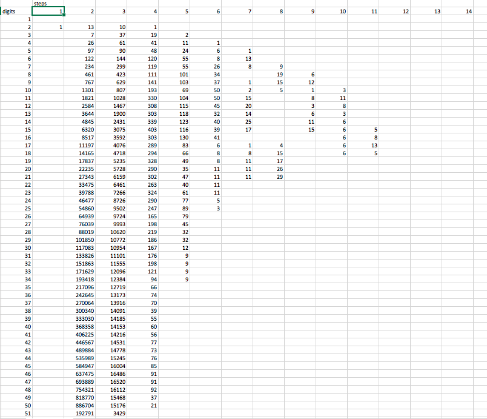

# Multiplicative Persistence Calculator

I got inspired by [Numberphile](https://www.youtube.com/watch?v=Wim9WJeDTHQ) to try and find 
a number with more than 11 steps. I don't think one exists. As digit lengths get
larger and larger the probability of finding each step excluding a 0 drops. 

Ran this up to 410 digit lenghts without finding more than 11 steps.

